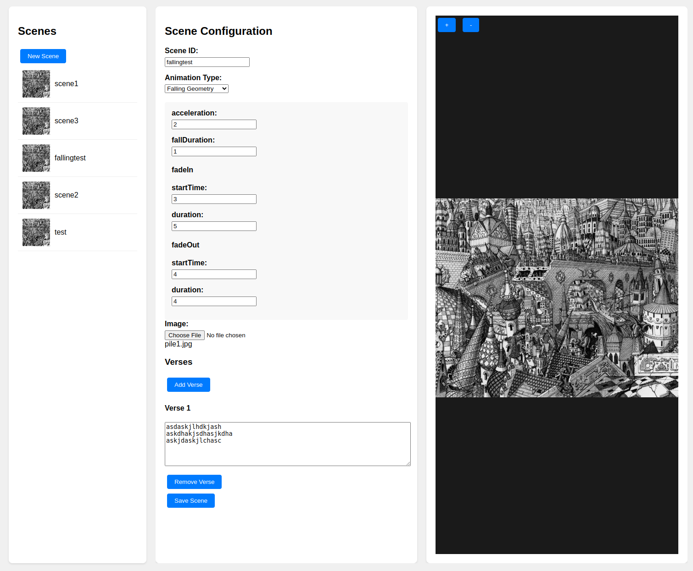

# pile
Pile visual novel engine


This project is a web-based visual novel viewer. It is sort of like a slide-show for animated text and images. It is extensible with several types of transitions already, including machine-vision image-geometry based transitions.

You can configure "scenes", which are both an image and a set of verses of text. A "novel" is composed of a series of scenes.

The engine is named after "Pile: Petals from St. Klaed's Computer", the epic poem it was built to display.
## Installation

1. Ensure you have Python 3.12 or higher installed
2. Clone this repository
3. Install dependencies using uv:

```
uv venv
source .venv/bin/activate
uv sync
```

## Launch Engine
`python app.py` 

## Landing Page

The homepage of the app is a landing page where you can see all of the novels and scenes that you have created. There are links to the novel and scene editors as well.


## Scene Editor

Configure available scenes.


